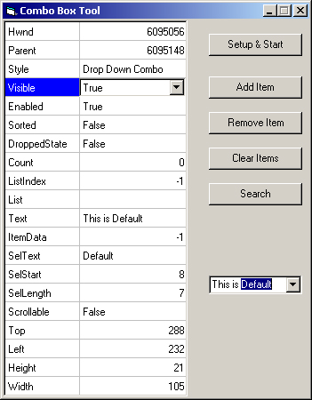

<div align="center">

## ComboBox API


</div>

### Description

This code uses API to get/set properties of most any combobox. I have designed it to work as an object so that you can just input the handle of your combobox and get/set the properties. Sample Included of course.
 
### More Info
 
you can input your own combobox handle in the sample or you can just use the default given in the sample.


<span>             |<span>
---                |---
**Submitted On**   |2002-11-09 17:56:20
**By**             |[Billy Conner](https://github.com/Planet-Source-Code/PSCIndex/blob/master/ByAuthor/billy-conner.md)
**Level**          |Advanced
**User Rating**    |4.7 (14 globes from 3 users)
**Compatibility**  |VB 6\.0
**Category**       |[Custom Controls/ Forms/  Menus](https://github.com/Planet-Source-Code/PSCIndex/blob/master/ByCategory/custom-controls-forms-menus__1-4.md)
**World**          |[Visual Basic](https://github.com/Planet-Source-Code/PSCIndex/blob/master/ByWorld/visual-basic.md)
**Archive File**   |[ComboBox\_A1494631192002\.zip](https://github.com/Planet-Source-Code/billy-conner-combobox-api__1-40572/archive/master.zip)

### API Declarations

```
quite a few.
I am currently in the process of making classes for Textbox,Listbox, and Command button. since this site's voting is based 70%+ on GUI i decided to make a sample app to use it. please vote on the class itself if you will, comments would be nice also.
```


